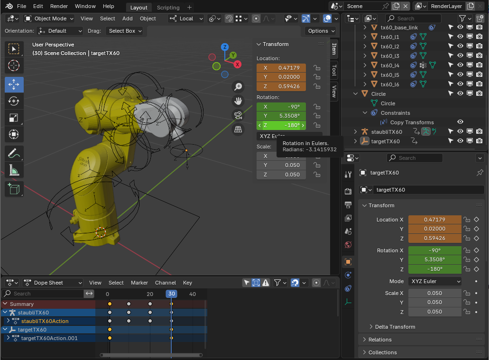

# blendeROS

blendeROS is a blender addon to extract joint positions from a rigged/simulated robot and control a real robot arm using ROS indusstrial by sending actions.

blendeROS uses roslibpy to send actions (followJointTrajectoryGoal) to ROS through rosbridge-server 

---
### features

the addon will insert a sidebar panel (shortcut 'N') where IK can be enabled/dissabled

joint positions can be visualized in both modes in degrees

there is a 'reset to rest position', a (dis/)connect to rosbridge button and a button to build and send actions from the animation. in addition a velocity slider allows to control the speed from 0.0 to 1.0 (0-100%)

roslibpy 1.2.0 has to be installed, either by...
 * using blenders bundles python (using pip)
 * removing blender's python and using system's python (untested)

---

a blender demo file is included. the file contains a staubli TX60 rigged robot arm with the iTaSC solver configured

---

### instructions to install

zip the blendeROS folder and install the addon as usualy

windows and mac haven't been tested yet

---

### TODO

currently the addon looks for a specific model (staubli's tx60)

current mode is unidirectional, (in 2021) tx60 streaming to ROS is not yet supported by the [staubli_val3_driver](http://wiki.ros.org/staubli_val3_driver)

